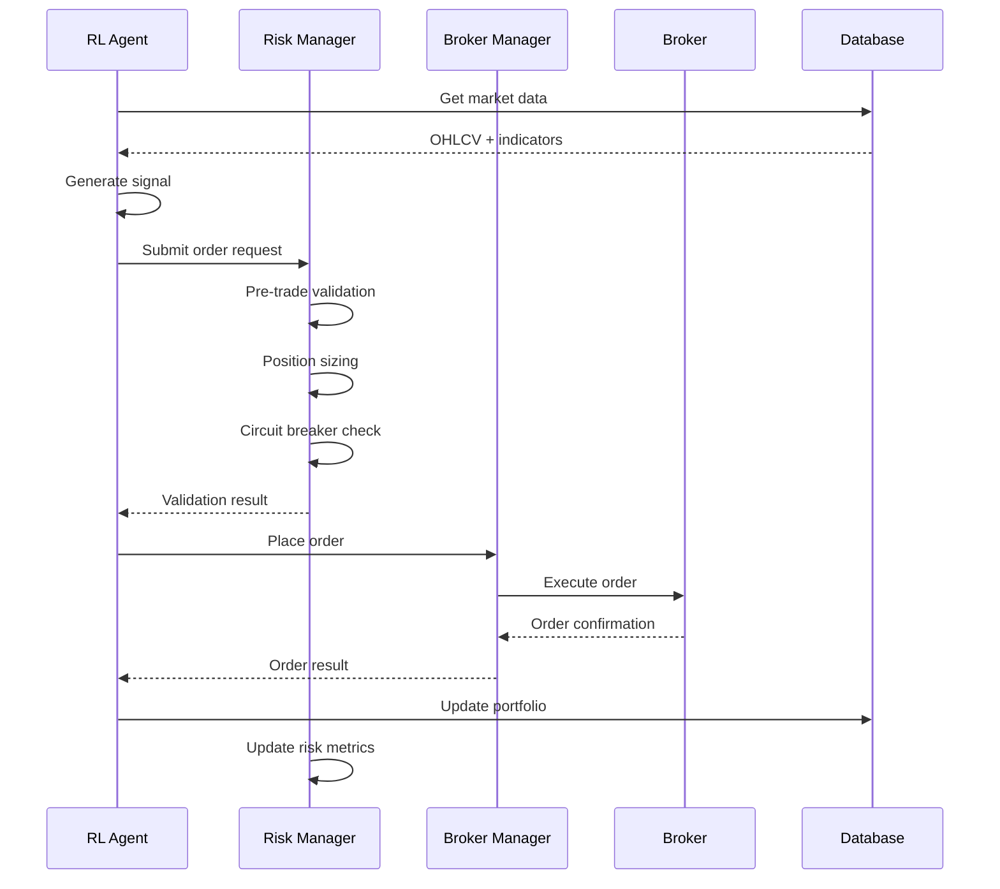
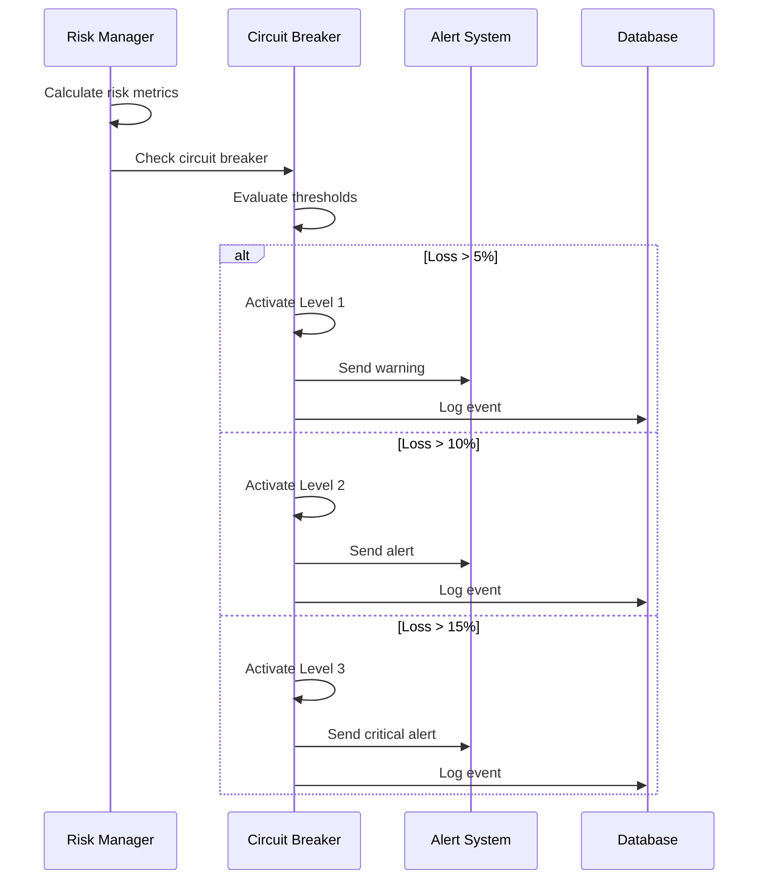
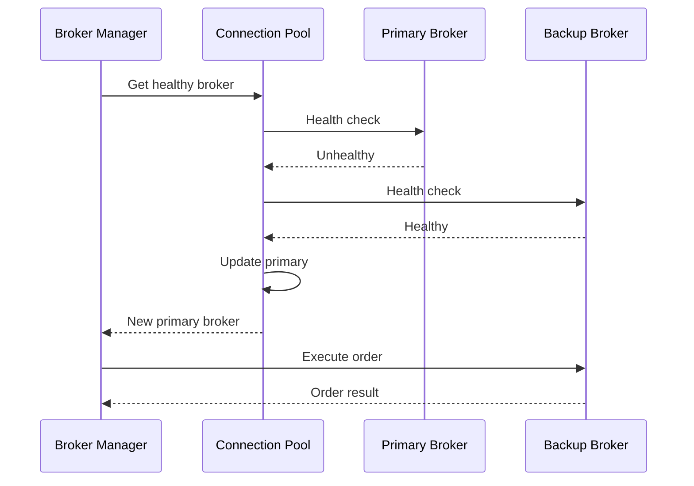

# MTQuant Architecture

## System Overview

MTQuant is a production-grade multi-agent AI trading system that combines Reinforcement Learning (RL) agents with comprehensive risk management to create an intelligent, adaptive trading platform. The system is designed for live trading with real money while maintaining strict safety controls.

## High-Level Architecture

```
┌─────────────────────────────────────────────────────────────────────────────┐
│                           MTQuant Trading System                            │
├─────────────────────────────────────────────────────────────────────────────┤
│  Frontend Layer (React + TypeScript)                                       │
│  ├── Trading Dashboard                                                      │
│  ├── Risk Management Interface                                              │
│  ├── Agent Performance Monitoring                                           │
│  └── Real-time Market Data Visualization                                    │
├─────────────────────────────────────────────────────────────────────────────┤
│  API Layer (FastAPI + WebSocket)                                           │
│  ├── REST API Endpoints                                                     │
│  ├── WebSocket Real-time Updates                                            │
│  ├── Authentication & Authorization                                         │
│  └── Rate Limiting & Security                                               │
├─────────────────────────────────────────────────────────────────────────────┤
│  Business Logic Layer                                                       │
│  ├── Agent Manager (RL Agent Orchestration)                                │
│  ├── Risk Manager (3-Tier Risk Management)                                 │
│  ├── Portfolio Manager (Position Aggregation)                              │
│  └── Signal Processor (Agent Signal Processing)                            │
├─────────────────────────────────────────────────────────────────────────────┤
│  Agent Layer (Reinforcement Learning)                                      │
│  ├── PPO Agents (Per Instrument)                                           │
│  ├── Trading Environments (Gymnasium Compatible)                           │
│  ├── Feature Engineering Pipeline                                           │
│  └── Model Training & Evaluation                                            │
├─────────────────────────────────────────────────────────────────────────────┤
│  Broker Integration Layer (MCP Protocol)                                   │
│  ├── Broker Manager (Multi-Broker Support)                                 │
│  ├── Connection Pool (Health Monitoring)                                   │
│  ├── Symbol Mapper (Cross-Broker Symbol Mapping)                           │
│  └── Adapters (MT4/MT5, OANDA, Interactive Brokers)                       │
├─────────────────────────────────────────────────────────────────────────────┤
│  Data Layer                                                                │
│  ├── QuestDB (Time-Series Data)                                            │
│  ├── PostgreSQL (Transactional Data)                                       │
│  ├── Redis (Hot Data Cache)                                                │
│  └── Data Processors (Feature Engineering)                                 │
└─────────────────────────────────────────────────────────────────────────────┘
```

## Component Architecture

### 1. Agent Manager

The Agent Manager orchestrates multiple RL agents, each specialized for a specific financial instrument.

```
┌─────────────────────────────────────────────────────────────┐
│                    Agent Manager                            │
├─────────────────────────────────────────────────────────────┤
│  Agent Lifecycle Management                                 │
│  ├── Agent Initialization                                   │
│  ├── Training Orchestration                                 │
│  ├── Deployment Management                                  │
│  └── Health Monitoring                                      │
├─────────────────────────────────────────────────────────────┤
│  Signal Processing                                          │
│  ├── Signal Aggregation                                     │
│  ├── Signal Validation                                      │
│  ├── Signal Prioritization                                  │
│  └── Signal Distribution                                    │
├─────────────────────────────────────────────────────────────┤
│  Performance Monitoring                                     │
│  ├── Real-time Metrics                                      │
│  ├── Historical Performance                                │
│  ├── Risk Metrics                                           │
│  └── Alert Management                                       │
└─────────────────────────────────────────────────────────────┘
```

**Key Responsibilities**:
- Initialize and manage RL agents for each instrument
- Coordinate training schedules and resource allocation
- Process and validate agent signals
- Monitor agent performance and health
- Handle agent failures and recovery

### 2. Risk Manager

The Risk Manager provides a comprehensive 3-tier defense system to protect trading capital.

```
┌─────────────────────────────────────────────────────────────┐
│                    Risk Manager                             │
├─────────────────────────────────────────────────────────────┤
│  Tier 1: Pre-Trade Validation (<50ms)                      │
│  ├── PreTradeChecker                                        │
│  │   ├── Price Band Validation                             │
│  │   ├── Position Size Limits                              │
│  │   ├── Capital Verification                              │
│  │   ├── Portfolio Exposure Check                          │
│  │   ├── Regulatory Compliance                             │
│  │   └── Correlation Risk Assessment                       │
│  └── Validation Results                                     │
├─────────────────────────────────────────────────────────────┤
│  Tier 2: Position Sizing & Risk Calculation                │
│  ├── PositionSizer                                          │
│  │   ├── Kelly Criterion Method                            │
│  │   ├── Volatility-Based Sizing                           │
│  │   ├── Fixed Fractional Method                           │
│  │   └── Dynamic Risk Adjustment                           │
│  └── Sizing Results                                         │
├─────────────────────────────────────────────────────────────┤
│  Tier 3: Circuit Breaker System                            │
│  ├── CircuitBreaker                                         │
│  │   ├── Level 1: Warning (5% loss)                       │
│  │   ├── Level 2: Reduce Positions (10% loss)             │
│  │   ├── Level 3: Full Halt (15% loss)                    │
│  │   └── Automatic Recovery & Reset                        │
│  └── Breaker Status                                         │
└─────────────────────────────────────────────────────────────┘
```

**Key Responsibilities**:
- Validate all orders before execution
- Calculate optimal position sizes
- Monitor portfolio risk metrics
- Activate circuit breakers when necessary
- Provide risk alerts and notifications

### 3. Broker Integration Layer

The Broker Integration Layer provides unified access to multiple brokers through the Model Context Protocol (MCP).

```
┌─────────────────────────────────────────────────────────────┐
│                Broker Integration Layer                     │
├─────────────────────────────────────────────────────────────┤
│  Broker Manager                                             │
│  ├── Multi-Broker Initialization                           │
│  ├── Intelligent Routing                                    │
│  ├── Aggregated Operations                                  │
│  └── Status Monitoring                                      │
├─────────────────────────────────────────────────────────────┤
│  Connection Pool                                            │
│  ├── Health Monitoring (30s intervals)                     │
│  ├── Automatic Failover                                     │
│  ├── Connection Statistics                                  │
│  └── MCP Server Lifecycle Management                       │
├─────────────────────────────────────────────────────────────┤
│  Symbol Mapper                                              │
│  ├── Standard Symbol Mapping                                │
│  ├── Broker-Specific Symbols                                │
│  ├── Symbol Metadata                                        │
│  └── Cross-Broker Validation                                │
├─────────────────────────────────────────────────────────────┤
│  Broker Adapters                                            │
│  ├── MT5 Adapter (MCP Client)                              │
│  ├── MT4 Adapter (HTTP MCP Client)                         │
│  ├── OANDA Adapter (REST API)                              │
│  └── Interactive Brokers Adapter (TWS API)                 │
└─────────────────────────────────────────────────────────────┘
```

**Key Responsibilities**:
- Manage connections to multiple brokers
- Provide intelligent routing for orders
- Aggregate positions and account information
- Handle broker failures and failover
- Map symbols across different brokers

### 4. Data Layer

The Data Layer provides efficient storage and retrieval of trading data.

```
┌─────────────────────────────────────────────────────────────┐
│                      Data Layer                            │
├─────────────────────────────────────────────────────────────┤
│  QuestDB (Time-Series Database)                            │
│  ├── OHLCV Data (1m, 5m, 15m, 1h, 4h, 1d)                │
│  ├── Tick Data (Real-time)                                 │
│  ├── Technical Indicators                                   │
│  └── Market Data Aggregation                                │
├─────────────────────────────────────────────────────────────┤
│  PostgreSQL (Transactional Database)                       │
│  ├── Orders & Trades                                        │
│  ├── Positions & Portfolio                                  │
│  ├── Agent Configurations                                   │
│  ├── Risk Management Data                                   │
│  └── Audit Logs                                            │
├─────────────────────────────────────────────────────────────┤
│  Redis (Hot Data Cache)                                     │
│  ├── Latest Prices (TTL: 60s)                              │
│  ├── Agent States                                           │
│  ├── Risk Metrics                                           │
│  └── Session Data                                           │
├─────────────────────────────────────────────────────────────┤
│  Data Processors                                            │
│  ├── Feature Engineering                                    │
│  ├── Technical Indicators                                   │
│  ├── Data Normalization                                     │
│  └── Data Validation                                        │
└─────────────────────────────────────────────────────────────┘
```

**Key Responsibilities**:
- Store and retrieve market data efficiently
- Maintain transactional integrity
- Provide fast access to hot data
- Process and engineer features for ML models

## Data Flow Architecture

### 1. Trading Signal Flow

```
┌─────────────┐    ┌─────────────┐    ┌─────────────┐    ┌─────────────┐
│   Market    │    │    RL       │    │    Risk     │    │   Broker    │
│   Data      │───▶│   Agent     │───▶│  Manager    │───▶│  Manager    │
│             │    │             │    │             │    │             │
└─────────────┘    └─────────────┘    └─────────────┘    └─────────────┘
       │                   │                   │                   │
       ▼                   ▼                   ▼                   ▼
┌─────────────┐    ┌─────────────┐    ┌─────────────┐    ┌─────────────┐
│  QuestDB    │    │  Signal     │    │  Validation │    │   Order     │
│ (OHLCV)     │    │ Processing  │    │  Results    │    │ Execution   │
└─────────────┘    └─────────────┘    └─────────────┘    └─────────────┘
```

**Detailed Flow**:
1. **Market Data Ingestion**: Real-time OHLCV data stored in QuestDB
2. **Feature Engineering**: Technical indicators and features calculated
3. **Agent Inference**: RL agent processes state and generates signal
4. **Risk Validation**: PreTradeChecker validates order parameters
5. **Position Sizing**: PositionSizer calculates optimal position size
6. **Circuit Breaker Check**: Verify trading is allowed
7. **Order Execution**: BrokerManager places order with selected broker
8. **Portfolio Update**: Update positions and risk metrics

### 2. Risk Management Flow

```
┌─────────────┐    ┌─────────────┐    ┌─────────────┐    ┌─────────────┐
│   Portfolio │    │    Risk     │    │  Circuit    │    │   Alert     │
│   State     │───▶│  Metrics    │───▶│  Breaker    │───▶│  System     │
│             │    │             │    │             │    │             │
└─────────────┘    └─────────────┘    └─────────────┘    └─────────────┘
       │                   │                   │                   │
       ▼                   ▼                   ▼                   ▼
┌─────────────┐    ┌─────────────┐    ┌─────────────┐    ┌─────────────┐
│ PostgreSQL  │    │  Real-time  │    │   Status    │    │  Email/SMS  │
│ (Audit)     │    │ Monitoring  │    │  Updates    │    │  Notifications│
└─────────────┘    └─────────────┘    └─────────────┘    └─────────────┘
```

**Detailed Flow**:
1. **Portfolio Monitoring**: Continuous monitoring of portfolio state
2. **Risk Calculation**: Real-time calculation of risk metrics
3. **Threshold Checking**: Compare metrics against risk limits
4. **Circuit Breaker Activation**: Activate appropriate circuit breaker level
5. **Alert Generation**: Send alerts to risk management team
6. **Audit Logging**: Log all risk events for compliance

### 3. Multi-Broker Flow

```
┌─────────────┐    ┌─────────────┐    ┌─────────────┐    ┌─────────────┐
│   Order     │    │   Broker    │    │ Connection  │    │   Broker    │
│  Request    │───▶│  Manager    │───▶│    Pool     │───▶│  Adapter    │
│             │    │             │    │             │    │             │
└─────────────┘    └─────────────┘    └─────────────┘    └─────────────┘
       │                   │                   │                   │
       ▼                   ▼                   ▼                   ▼
┌─────────────┐    ┌─────────────┐    ┌─────────────┐    ┌─────────────┐
│  Symbol     │    │ Intelligent │    │   Health    │    │   MCP       │
│  Mapping    │    │  Routing    │    │ Monitoring  │    │  Protocol   │
└─────────────┘    └─────────────┘    └─────────────┘    └─────────────┘
```

**Detailed Flow**:
1. **Order Request**: Agent or user submits order request
2. **Symbol Mapping**: Convert standard symbol to broker-specific symbol
3. **Broker Selection**: Intelligent routing based on health and preferences
4. **Connection Check**: Verify broker connection is healthy
5. **Order Execution**: Execute order through selected broker adapter
6. **Result Processing**: Process execution results and update portfolio

## Sequence Diagrams

### 1. Complete Trading Flow



### 2. Risk Management Flow



### 3. Multi-Broker Failover



## Technology Stack

### Backend Technologies
- **Python 3.11+**: Core programming language
- **FastAPI**: High-performance API framework
- **Stable-Baselines3**: Reinforcement Learning library
- **Gymnasium**: RL environment framework
- **Pandas**: Data manipulation and analysis
- **NumPy**: Numerical computing
- **Pydantic**: Data validation and settings
- **AsyncIO**: Asynchronous programming

### Database Technologies
- **QuestDB**: Time-series database for market data
- **PostgreSQL**: Relational database for transactional data
- **Redis**: In-memory cache for hot data
- **SQLAlchemy**: Database ORM and query builder

### Broker Integration
- **MCP (Model Context Protocol)**: Standardized broker communication
- **MT5 MCP Server**: Python-based MT5 integration
- **MT4 MCP Server**: Node.js-based MT4 integration
- **HTTP/WebSocket**: Real-time communication protocols

### Development Tools
- **Pytest**: Testing framework
- **Black**: Code formatting
- **Ruff**: Fast Python linter
- **MyPy**: Static type checking
- **Docker**: Containerization
- **Git**: Version control

## Deployment Architecture

### Development Environment
```
┌─────────────┐    ┌─────────────┐    ┌─────────────┐
│   Local     │    │   Local     │    │   Local     │
│  Python     │    │  QuestDB    │    │ PostgreSQL  │
│   App       │    │   (Docker)  │    │   (Docker)  │
└─────────────┘    └─────────────┘    └─────────────┘
```

### Production Environment
```
┌─────────────┐    ┌─────────────┐    ┌─────────────┐
│   Load      │    │   App       │    │   Database  │
│  Balancer   │    │  Servers    │    │   Cluster   │
│   (Nginx)   │    │ (Multiple)  │    │ (Replicated)│
└─────────────┘    └─────────────┘    └─────────────┘
       │                   │                   │
       ▼                   ▼                   ▼
┌─────────────┐    ┌─────────────┐    ┌─────────────┐
│   SSL       │    │   Redis     │    │   Backup    │
│ Certificate │    │   Cluster   │    │   Storage   │
└─────────────┘    └─────────────┘    └─────────────┘
```

## Security Architecture

### Authentication & Authorization
- **JWT Tokens**: Stateless authentication
- **Role-Based Access Control**: Different permission levels
- **API Key Management**: Secure broker API access
- **Session Management**: Secure user sessions

### Data Security
- **Encryption at Rest**: Database encryption
- **Encryption in Transit**: TLS/SSL for all communications
- **Secure Credentials**: Environment variable management
- **Audit Logging**: Comprehensive audit trail

### Network Security
- **Firewall Rules**: Restrict network access
- **VPN Access**: Secure remote access
- **Rate Limiting**: Prevent abuse
- **DDoS Protection**: Protect against attacks

## Monitoring & Observability

### Application Monitoring
- **Health Checks**: Component health monitoring
- **Performance Metrics**: Response times and throughput
- **Error Tracking**: Exception monitoring and alerting
- **Log Aggregation**: Centralized logging

### Business Monitoring
- **Trading Metrics**: P&L, win rate, Sharpe ratio
- **Risk Metrics**: Drawdown, exposure, correlation
- **Agent Performance**: Individual agent metrics
- **Broker Performance**: Execution quality and latency

### Infrastructure Monitoring
- **System Resources**: CPU, memory, disk usage
- **Database Performance**: Query performance and connections
- **Network Monitoring**: Latency and connectivity
- **Alert Management**: Proactive issue detection

## Scalability Considerations

### Horizontal Scaling
- **Stateless Design**: Enable multiple app instances
- **Load Balancing**: Distribute traffic across instances
- **Database Sharding**: Partition data across databases
- **Cache Distribution**: Distribute cache across nodes

### Vertical Scaling
- **Resource Optimization**: Efficient resource utilization
- **Database Tuning**: Optimize database performance
- **Memory Management**: Efficient memory usage
- **CPU Optimization**: Parallel processing where possible

### Performance Optimization
- **Async Processing**: Non-blocking I/O operations
- **Connection Pooling**: Efficient database connections
- **Caching Strategy**: Multi-level caching
- **Query Optimization**: Efficient database queries

## Conclusion

The MTQuant architecture provides a robust, scalable, and secure foundation for AI-powered trading. The modular design allows for easy extension and maintenance, while the comprehensive risk management ensures safe operation with real money. The use of modern technologies and best practices ensures high performance and reliability.

Key architectural strengths:
- **Modularity**: Clear separation of concerns
- **Scalability**: Horizontal and vertical scaling support
- **Security**: Comprehensive security measures
- **Reliability**: Fault tolerance and failover mechanisms
- **Observability**: Comprehensive monitoring and logging
- **Maintainability**: Clean code and documentation

